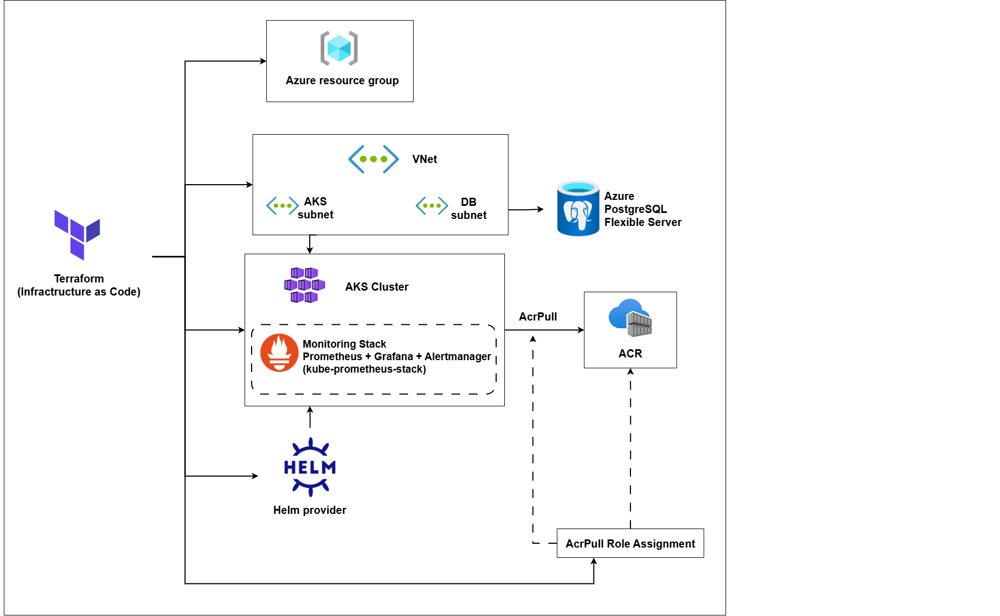
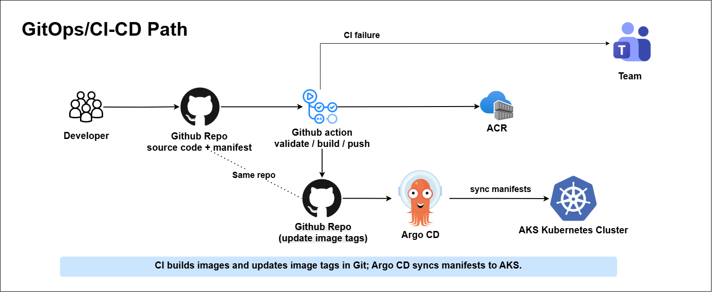
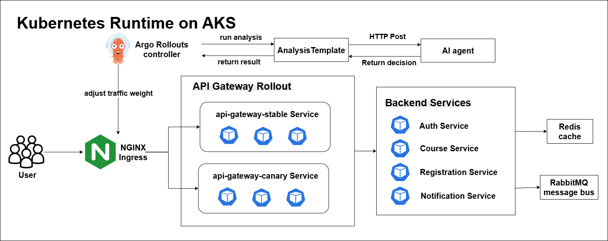
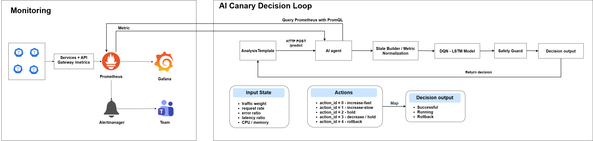
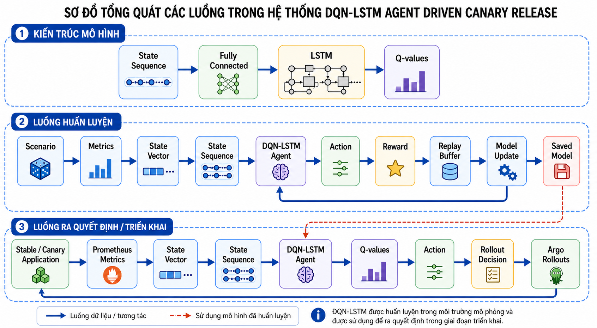

# Cloud-Native DevOps Pipeline for UIT Course Registration Platform
Microservices-based course registration system deployed on Azure Kubernetes Service with GitHub Actions, Argo CD, Argo Rollouts, Terraform, Prometheus/Grafana monitoring, and an AI-assisted canary decision service.

## Overview
The project simulates a university course registration platform. Users access the application through an NGINX Ingress public endpoint. The API Gateway routes requests to backend services, while PostgreSQL, Redis, and RabbitMQ support persistence, caching, and asynchronous messaging.
The DevOps flow is built around GitOps:
- GitHub Actions validates code, builds Docker images, and pushes them to Azure Container Registry.
- Kubernetes manifests are updated in Git with immutable image tags.
- Argo CD syncs the desired state from Git to AKS.
- Argo Rollouts performs canary rollout for the API Gateway.
- Prometheus collects metrics, Grafana visualizes them, and Alertmanager sends alerts.
- The AI Agent evaluates canary metrics and returns rollout decisions.

## System Architecture

### Infrastructure As Code

Terraform manages the main Azure infrastructure: resource group, virtual network, AKS, ACR, PostgreSQL Flexible Server, remote state, AKS autoscaling, AcrPull role assignment, and the monitoring stack through the Helm provider.
### GitOps / CI-CD Path

The CI/CD pipeline validates source code, builds service images, pushes images to ACR, and updates Kubernetes manifests with the new commit SHA image tags. Argo CD then syncs those manifests to AKS.
### Kubernetes Runtime On AKS

The runtime layer contains the NGINX Ingress, API Gateway Rollout, stable/canary API Gateway services, backend services, Redis, RabbitMQ, and the Argo Rollouts controller.
### Monitoring And AI Canary Decision

Prometheus scrapes service and API Gateway metrics. Grafana displays dashboards. Alertmanager sends alerts to Microsoft Teams. Argo Rollouts calls the AI Agent through an AnalysisTemplate, and the AI Agent queries Prometheus before returning `Successful`, `Running`, or `Rollback`.
### Canary Release Flow

The AI Agent uses normalized runtime metrics and a trained DQN-LSTM model, with an additional safety guard, to support canary rollout decisions.
## Main Components
```text
frontend/              React frontend
api-gateway/           API Gateway and metrics endpoint
services/auth/         Authentication and user management
services/course/       Course and class management
services/registration/ Course registration workflow
services/notification/ Notification service
database/              PostgreSQL migrations and seed data
k8s/                   Kubernetes manifests
terraform/             Azure infrastructure as code
argocd/                GitOps application and notifications
monitoring/            Prometheus rules, ServiceMonitors, dashboards
ai-agent/              AI canary decision service
```
## DevOps Capabilities
- **Infrastructure as Code**: Terraform provisions and validates Azure infrastructure.
- **CI/CD**: GitHub Actions validates, tests, builds, pushes images, and updates manifests.
- **GitOps**: Argo CD continuously syncs Kubernetes manifests from Git to AKS.
- **Progressive Delivery**: Argo Rollouts manages stable/canary rollout for the API Gateway.
- **Monitoring**: Prometheus, Grafana, Alertmanager, ServiceMonitor, and PrometheusRule.
- **AI-assisted Canary**: The AI Agent evaluates Prometheus metrics and returns rollout decisions.
- **Autoscaling**: Kubernetes HPA scales application pods, and AKS node pool autoscaling is enabled.
## Demo Scenarios
The main demo flow covers:
1. Web application usage.
2. GitHub Actions CI/CD pipeline.
3. Argo CD GitOps sync.
4. Kubernetes runtime checks on AKS.
5. Argo Rollouts canary success.
6. Argo Rollouts rollback.
7. Monitoring dashboards and alerting.
8. Terraform validation, plan, output, remote state, and AKS autoscaling checks.
## Public Demo
```text
http://20.44.237.162
```
Demo accounts and temporary passwords should be provided separately by the project owner. Do not commit real credentials to Git.
## Deployment Guide
For a new environment, follow the documentation in this order. The root README only describes the flow; each linked document contains the detailed commands.
1. **Prepare local configuration**
   Copy the sample environment file and review required values.
   ```text
   local-development.md
   ```

2. **Provision Azure infrastructure**
   Create or connect the Terraform remote state, provision the Azure resource group, VNet, AKS, ACR, PostgreSQL Flexible Server, role assignments, autoscaling, and monitoring Helm release. After Terraform finishes, get the AKS kubeconfig before running any `kubectl` command.
   ```text
   terraform/README.md
   ```

3. **Prepare database migrations and seed data**
   Review migration order, seed data, and the Kubernetes migration job.
   ```text
   database/README.md
   ```

4. **Configure GitHub Actions secrets**
   Set the required repository secrets for Terraform, Azure login, ACR, optional SonarQube, and Teams webhook before running CI/CD.
   ```text
   .github/workflows/terraform.yml
   .github/workflows/*-service.yml
   .github/workflows/api-gateway.yml
   .github/workflows/ai-agent.yml
   ```

5. **Install and configure Argo CD**
   Install Argo CD, apply the `uit-course` application, and verify GitOps sync from the `k8s/` directory to AKS.
   ```text
   argocd/README.md
   ```

6. **Configure ingress and public access**
   Install or verify NGINX Ingress, public IP access, and ingress rules.
   ```text
   k8s/ingress/README.md
   ```

7. **Enable monitoring**
   Apply Prometheus rules, ServiceMonitors, Grafana dashboards, and Alertmanager Teams integration.
   ```text
   monitoring/README.md
   ```

8. **Enable Argo Rollouts and AI canary analysis**
   Verify the API Gateway Rollout, AnalysisTemplate, canary AI Agent deployment, and rollout demo commands.
   ```text
   k8s/rollouts/README.md
   ai-agent/README.md
   ```

9. **Operate and verify the deployment**
   Use the operational checks to inspect pods, services, ingress, HPA, Argo CD, rollout status, and cost-control start/stop commands.
   ```text
   operations.md
   ```

## Environment Values To Review
Before deploying to a different Azure subscription or repository, review these project-specific values and replace them with values for your own environment.

```text
Azure resource group: uit-dkhp-rg
AKS cluster: devops-aks
Azure Container Registry: uitdkhpacr2026
ACR login server: uitdkhpacr2026.azurecr.io
PostgreSQL server: uit-dkhp-pg-server
Terraform state container: tfstate
Public application IP: 20.44.237.162
Argo CD application: uit-course
Kubernetes namespace: default
Monitoring namespace: monitoring
```

## GitHub Actions

The project uses separate GitHub Actions workflows instead of one monolithic pipeline:

```text
.github/workflows/terraform.yml              Terraform fmt, init, validate, Checkov, plan, apply
.github/workflows/frontend.yml               Frontend test/audit/build only
.github/workflows/auth-service.yml           Auth service CI/CD
.github/workflows/course-service.yml         Course service CI/CD
.github/workflows/registration-service.yml   Registration service CI/CD
.github/workflows/notification-service.yml   Notification service CI/CD
.github/workflows/api-gateway.yml            API Gateway CI/CD, also rebuilds when frontend changes
.github/workflows/ai-agent.yml               AI Agent CI/CD
.github/workflows/db-migration.yml           Database migration image CI/CD
```

Each service workflow is path-filtered, so a change in one service only runs that service's pipeline. Service pipelines run tests, production dependency audit, optional SonarQube scan, Docker build, Trivy image vulnerability scan, ACR push, Kubernetes manifest image update, kubeconform validation, and GitHub Deployment creation. The frontend is bundled into the API Gateway image, so frontend changes also trigger `api-gateway.yml`.

Docker build contexts are limited with `.dockerignore` files so builds do not send `.git`, Terraform state, node_modules, local caches, or unrelated service folders to Docker.

Terraform runs `apply` only for push events on `main`.

## GitHub Actions Secrets And Variables

The workflows require these repository secrets:
```text
AZURE_CREDENTIALS    Azure service principal JSON used by azure/login
ACR_NAME             Azure Container Registry name, for example uitdkhpacr2026
ACR_LOGIN_SERVER     ACR login server, for example uitdkhpacr2026.azurecr.io
DB_ADMIN_PASSWORD    PostgreSQL admin password passed to Terraform as TF_VAR_db_admin_password
TFSTATE_STORAGE_ACCOUNT  Azure Storage Account used for Terraform remote state
TFSTATE_RESOURCE_GROUP    Optional remote state resource group, defaults to uit-tfstate-rg
TFSTATE_CONTAINER         Optional remote state container, defaults to tfstate
TFSTATE_KEY               Optional state key, defaults to uit-course.terraform.tfstate
SONAR_TOKEN          Optional token for SonarQube/SonarCloud scan
SONAR_HOST_URL       Optional SonarQube/SonarCloud host URL
TEAMS_WEBHOOK_URL    Optional Microsoft Teams webhook for CI/CD failure notifications
```

Optional repository variables:
```text
PUBLIC_APP_URL       Public application URL attached to GitHub Deployment statuses
SECURITY_GATE        Set to true to make Checkov, dependency audit, and Trivy findings fail workflows
```

Leave `SECURITY_GATE` unset or set to `false` for lab/demo pipelines. Set it to `true` only after dependency major upgrades have been planned, because the current NestJS services still have production dependency advisories that require breaking-version upgrades.

Do not commit real Azure credentials, webhook URLs, database passwords, `.env`, `backend.hcl`, `.tfvars`, or Terraform state files.

## Documentation
```text
terraform/README.md        Azure infrastructure, remote state, AKS, ACR, PostgreSQL
database/README.md         PostgreSQL migrations, seed data, migration job
argocd/README.md           Argo CD installation, application sync, notifications
monitoring/README.md       Prometheus, Grafana, Alertmanager, dashboards
k8s/ingress/README.md      NGINX Ingress and public access
k8s/rollouts/README.md     Argo Rollouts canary strategy and demo commands
ai-agent/README.md         AI Agent runtime, model, metrics, and API
local-development.md       Local Docker Compose development
operations.md              AKS checks and Azure cost control commands
```
